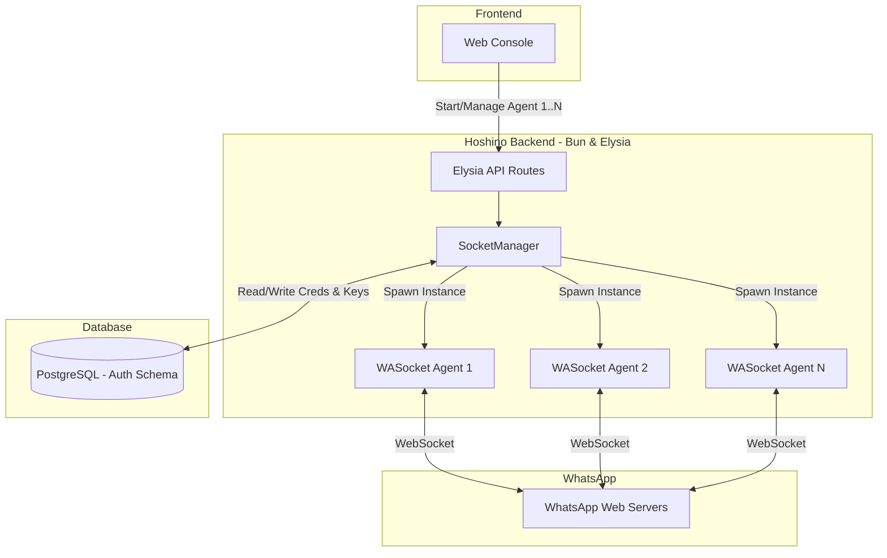
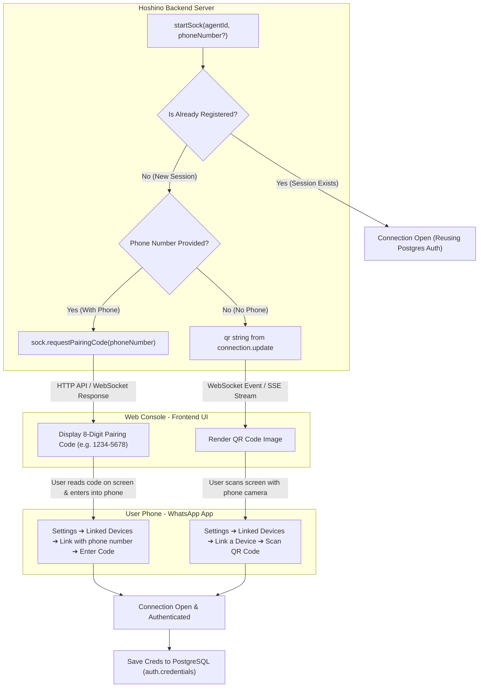
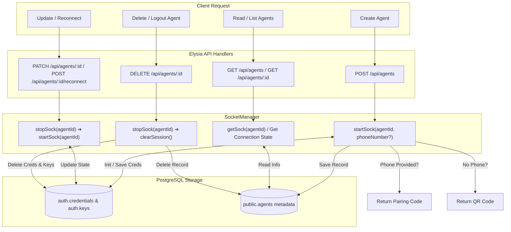

## Connecting Flow

## Agent Authentication Flow (Pairing Code vs QR Code)

## Agent CRUD Flow

## Production-Ready Socket Architecture Highlights
1. **Event Batching (`ev.process`)**: Combines all WebSocket events per tick to prevent callback flooding and partial state updates.
2. **Desktop Client Emulation (`Browsers.macOS("Desktop")`)**: Registers agents as official WhatsApp Desktop clients for high connection stability and extended history sync.
3. **Exponential Backoff Reconnecting**: Retries network disconnects with delays `1s -> 2s -> 4s -> 8s -> ... -> 30s max` to prevent rate-limiting.
4. **Group & Message Caching**: Automatically updates in-memory `NodeCache` for group metadata (`groups.update`, `group-participants.update`) and message keys for message retry handling (`getMessage`).