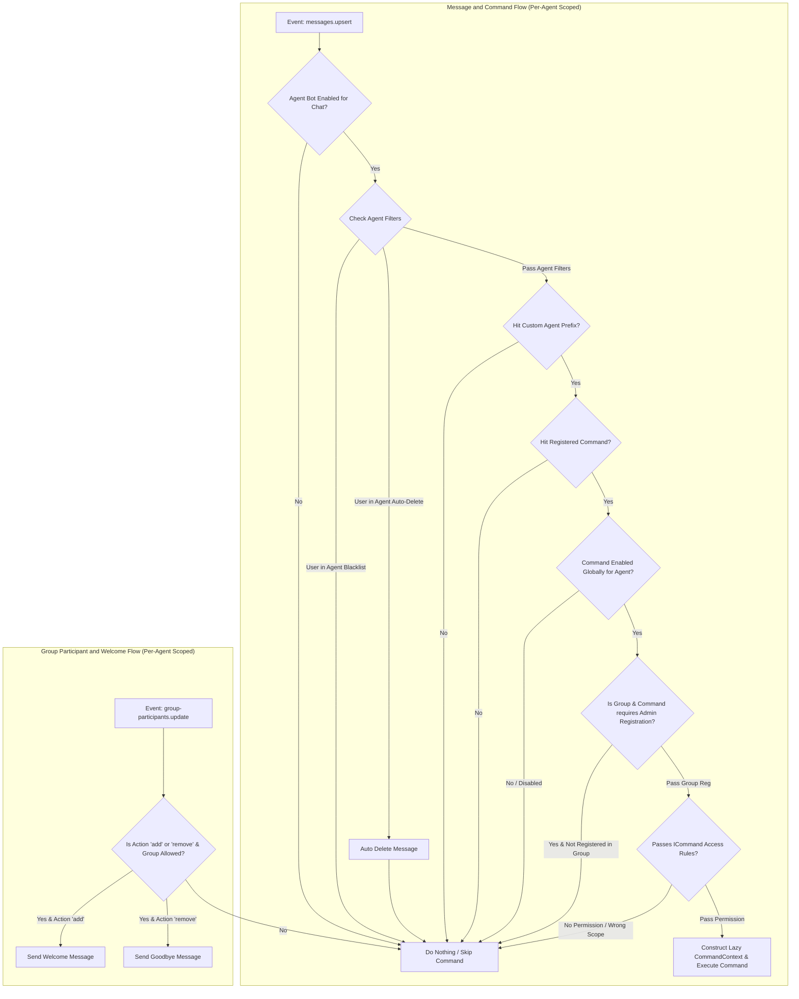

# Hoshino WhatsApp Architecture & Module Specification

## Core Modules & Design

1. **Baileys Module (`/src/modules/baileys`)**:
   - `auth.ts`: PostgreSQL multi-instance auth state persistence using `usePostgresAuthState`.
   - `socket.ts`: Manages multi-tenant WASocket lifecycle, reconnect logic, session caching, and event handling (`messages.upsert`, `connection.update`).
   - `types.ts`: Type definitions for `AgentSession`, `AgentStatus`, and session parameters.

2. **Repository Layer (`/src/repositories`)**:
   - `agent.repository.ts`: Handles database initialization, schema creation (`auth`, `public.agents`), and agent metadata queries.
   - `message.repository.ts`: Manages chat records (`public.chats`) and message history (`public.messages`) persistence.
   - `command.repository.ts`: Manages per-agent settings, owners, blacklists, autodeletes, global command toggles, and group command matrices.

3. **Services Layer (`/src/services`)**:
   - `wsManager.ts`: Manages real-time WebSocket client connections and broadcasts live events (`message_new`, `status_change`, `qr_code`) per agent instance.
   - `commandLoader.ts`: Manages dynamic command loading and 3-layer execution pipeline.
   - `contextBuilder.ts`: Constructs high-performance `CommandContext` with cached Lazy Resolvers.

4. **API & Route Layer (`/src/routes`)**:
   - `agents.ts`: Management endpoints (`POST /api/agents`, `GET /api/agents`, `POST /:id/reconnect`, `DELETE /:id`).
     - Multi-tenant settings endpoints:
       - `GET|POST|DELETE /api/agents/:id/owners`
       - `GET|POST|DELETE /api/agents/:id/blacklist`
       - `GET|POST|DELETE /api/agents/:id/autodelete`
       - `GET|PATCH /api/agents/:id/commands`
       - `GET|PATCH /api/agents/:id/groups/:jid`
   - `messages.ts`: Messaging endpoints (`POST /api/agents/:id/messages`, `GET /chats`, `GET /chats/:jid/messages`, `WS /ws`).

---

## Per-Agent Multi-Tenant Configuration Scope

Each agent instance operates with **isolated settings** in PostgreSQL:

| Setting Category | Scope | Description |
| :--- | :--- | :--- |
| **Agent Custom Prefix** | Per `agent_id` | Custom command prefix character(s) (e.g., `.`, `!`, `/`, `#`) configured specifically for this agent instance. |
| **Global Command Toggles** | Per `agent_id` | Per-agent toggle matrix allowing owners to enable or disable specific commands per agent instance globally. |
| **Agent Owners** | Per `agent_id` | List of owner/admin JIDs or LIDs allowed to run privileged commands on this specific agent. |
| **Command Blacklist** | Per `agent_id` | List of user JIDs/LIDs blocked from using bot commands for this specific agent. |
| **Auto-Delete List** | Per `agent_id` | Target user JIDs/LIDs whose messages in groups are automatically deleted by this agent (if bot is group admin). |
| **Group Bot Status** | Per `agent_id` & `jid` | Per-group toggle for Bot Enabled/Disabled status (`bot_enabled`). Controls if bot is allowed to send command messages in group. |
| **Group Registered Commands** | Per `agent_id` & `jid` | Per-group command registration matrix. Commands with `needAdminRegisterThisCommand = true` require explicit group admin activation before use in that group. |

---

## Command Interface Specification (`ICommand`) & Lazy Context

Every command module exports an `ICommand` definition containing optional permission and environment flags:

```typescript
export interface ICommand {
    name: string | string[]               // Command trigger name(s) e.g. "ping" or ["menu", "help"]
    category?: string                     // Category e.g. "general", "group", "owner", "ai"
    description?: string                  // Short description for menu listing
    access?: "user" | "owner" | "master"  // Access requirement (Default: "user")
    inGroup?: boolean                     // Requires message to originate from a group chat
    inGroupAccess?: "admin" | "member"    // Requires sender to be a group admin
    botAdminRequired?: boolean            // Requires bot instance to be a group admin
    needAdminRegisterThisCommand?: boolean // If true, requires Group Admin to explicitly enable/register this command in their group
    execute: (args: string[], ctx: CommandContext) => Promise<void> | void
}
```

### High-Performance Lazy Context (`CommandContext`)

To prevent performance degradation, `CommandContext` exposes raw Baileys objects (`rawMsg`, `sock`) instantly while deferring heavy DB/RPC operations to **Lazy Resolvers** that execute ONLY when accessed by a command:

```typescript
export interface CommandContext {
    // 1. Instant / Zero-Cost In-Memory Fields (0ms)
    agentId: string
    sock: WASocket
    rawMsg: WAMessage                     // Raw Baileys WAMessage object
    jid: string
    senderJid: string
    pushName?: string
    isGroup: boolean
    body: string
    prefix: string
    commandName: string
    args: string[]
    
    // 2. Fast Shortcut Helpers
    reply: (content: string | AnyMessageContent) => Promise<WAMessage>
    
    // 3. Lazy Resolvers (Executes DB/RPC/Network ONLY when explicitly called by command)
    getOwnerRole: () => Promise<"master" | "owner" | null>
    getGroupMetadata: () => Promise<GroupMetadata | null>
    getSenderAdminStatus: () => Promise<{ isAdmin: boolean; isBotAdmin: boolean }>
    getQuotedMessage: () => Promise<ParsedQuotedMessage | null>
    getMediaBuffer: () => Promise<Buffer | null>                    // Downloads media ONLY if command needs it
    getGroupInviteCode: () => Promise<string | null>                // Fetches invite code via RPC
    getProfilePicUrl: (targetJid?: string) => Promise<string | null>  // Fetches avatar URL via RPC
    getMentions: () => Promise<string[]>                            // Parsed mentioned JIDs array
    getBusinessProfile: (targetJid?: string) => Promise<WASMBusinessProfile | null> // Fetches WA Business details
    getNewsletterMetadata: (channelJid: string) => Promise<NewsletterMetadata | null> // Fetches WA Channel metadata
    getPollVotes: () => Promise<PollVoteResult[] | null>           // Aggregates poll votes on demand
}
```

---

## Command Handler & Message Handler Flow


