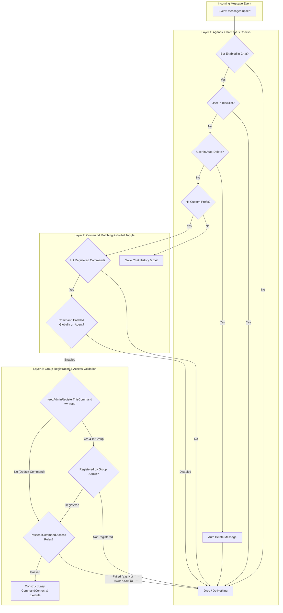
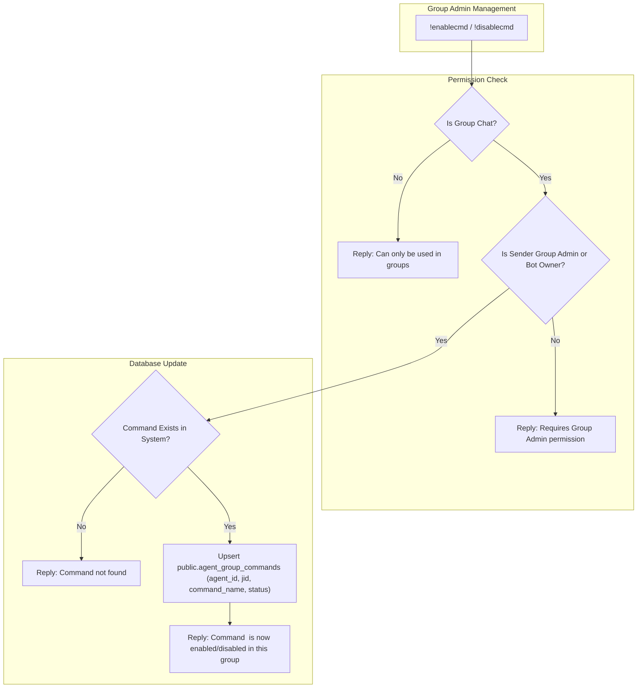

# Command Processing & Group Registration Feature Specification

## Overview

Hoshino features a **two-layer permission and isolation system** designed for high responsiveness:

1. **Bot Sending Command Permission (`bot_enabled`)**:
   Controls whether an agent instance is allowed to process commands or respond in a group/chat.
2. **Group Command Registration (`needAdminRegisterThisCommand`)**:
   Controls whether specific heavy or sensitive commands (e.g. NSFW, AI Image, Downloader) require explicit Group Admin activation/registration before being usable in that group.

---

## Command Processing Pipeline



---

## Group Command Registration & Management Flow



---

## Database Storage Specification

### 1. `public.agent_owners`
Stores owner JIDs/LIDs per agent instance.
```sql
CREATE TABLE IF NOT EXISTS public.agent_owners (
    agent_id VARCHAR(255) NOT NULL,
    user_jid VARCHAR(255) NOT NULL,
    role VARCHAR(50) DEFAULT 'owner', -- 'master' | 'owner'
    created_at TIMESTAMPTZ DEFAULT CURRENT_TIMESTAMP,
    PRIMARY KEY (agent_id, user_jid)
);
```

### 2. `public.agent_blacklists`
Stores blacklisted user JIDs/LIDs per agent instance.
```sql
CREATE TABLE IF NOT EXISTS public.agent_blacklists (
    agent_id VARCHAR(255) NOT NULL,
    user_jid VARCHAR(255) NOT NULL,
    reason TEXT,
    created_at TIMESTAMPTZ DEFAULT CURRENT_TIMESTAMP,
    PRIMARY KEY (agent_id, user_jid)
);
```

### 3. `public.agent_autodeletes`
Stores target user JIDs/LIDs whose messages in groups are auto-deleted per agent instance.
```sql
CREATE TABLE IF NOT EXISTS public.agent_autodeletes (
    agent_id VARCHAR(255) NOT NULL,
    user_jid VARCHAR(255) NOT NULL,
    created_at TIMESTAMPTZ DEFAULT CURRENT_TIMESTAMP,
    PRIMARY KEY (agent_id, user_jid)
);
```

### 4. `public.agent_group_settings`
Stores group-level settings per agent instance.
```sql
CREATE TABLE IF NOT EXISTS public.agent_group_settings (
    agent_id VARCHAR(255) NOT NULL,
    jid VARCHAR(255) NOT NULL,
    bot_enabled BOOLEAN DEFAULT true,
    welcome_enabled BOOLEAN DEFAULT false,
    goodbye_enabled BOOLEAN DEFAULT false,
    custom_prefix VARCHAR(10),
    updated_at TIMESTAMPTZ DEFAULT CURRENT_TIMESTAMP,
    PRIMARY KEY (agent_id, jid)
);
```

### 5. `public.agent_command_toggles`
Stores global command enable/disable matrix per agent instance.
```sql
CREATE TABLE IF NOT EXISTS public.agent_command_toggles (
    agent_id VARCHAR(255) NOT NULL,
    command_name VARCHAR(100) NOT NULL,
    status VARCHAR(50) DEFAULT 'enabled', -- 'enabled' | 'disabled'
    updated_at TIMESTAMPTZ DEFAULT CURRENT_TIMESTAMP,
    PRIMARY KEY (agent_id, command_name)
);
```

### 6. `public.agent_group_commands`
Stores group-level command registration matrix per agent instance.
```sql
CREATE TABLE IF NOT EXISTS public.agent_group_commands (
    agent_id VARCHAR(255) NOT NULL,
    jid VARCHAR(255) NOT NULL,
    command_name VARCHAR(100) NOT NULL,
    status VARCHAR(50) DEFAULT 'enabled', -- 'enabled' | 'disabled'
    updated_at TIMESTAMPTZ DEFAULT CURRENT_TIMESTAMP,
    PRIMARY KEY (agent_id, jid, command_name)
);
```
